FORMULARIO DE CONFIRMACIÓN PARA ASISTENCIA DE SAN PEDRITO
--------------------------------------------------------------
Esta aplicación móvil consiste en un formulario donde el usuario podrá registrar su participación para el desfile de San Pedrito.

1. PANTALLA FORMULARIO

    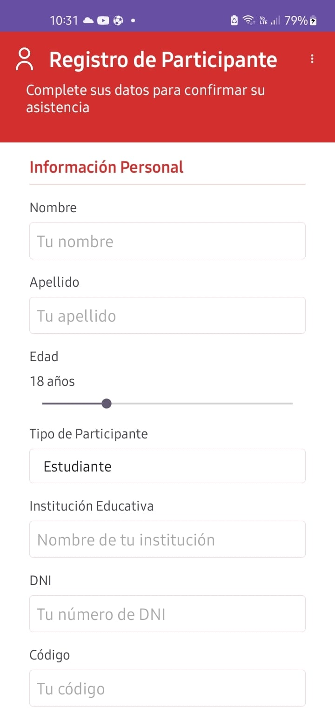
    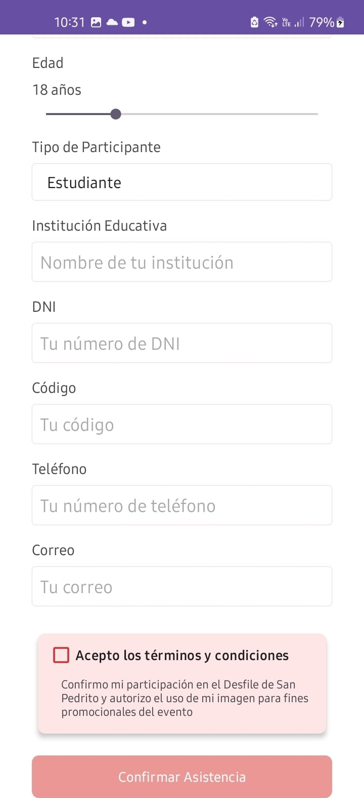

2. MENÚ DE OPCIONES 

    Se escogió implementar un menú de opciones en el cual se encontrará como opciones el WebView e Info.

    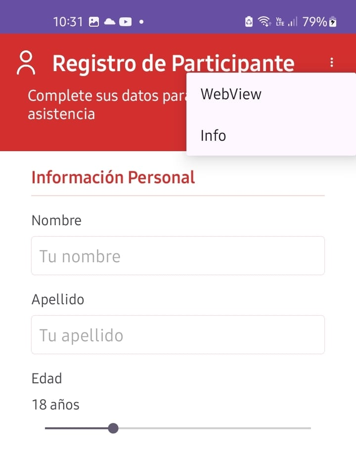

    2.1. WEBVIEW

        Se insertó el sguiente link: https://www.gob.pe/institucion/inabif/noticias/204485-car-san-pedrito-de-ancash-celebra-22-aniversario 
        El cual se mostrará al inicio del formulario cuando se seleccione el WebView.

        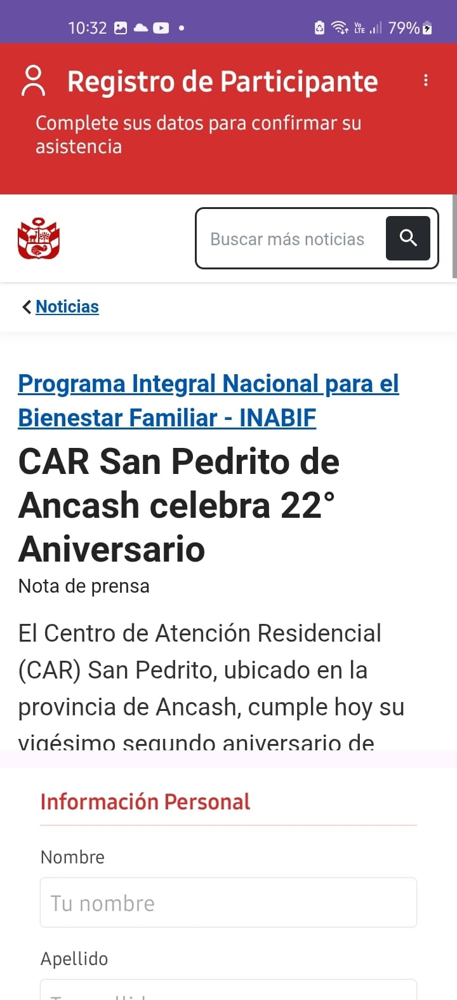
        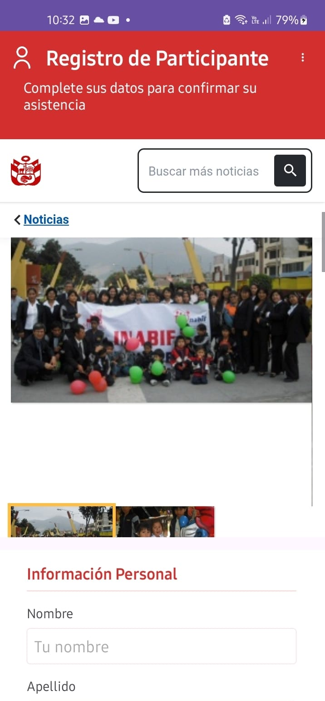

    2.2. INFO

        En caso se seleccione "info" en el menú de opciones, aparecerá una breve información acerca del aplicativo.

        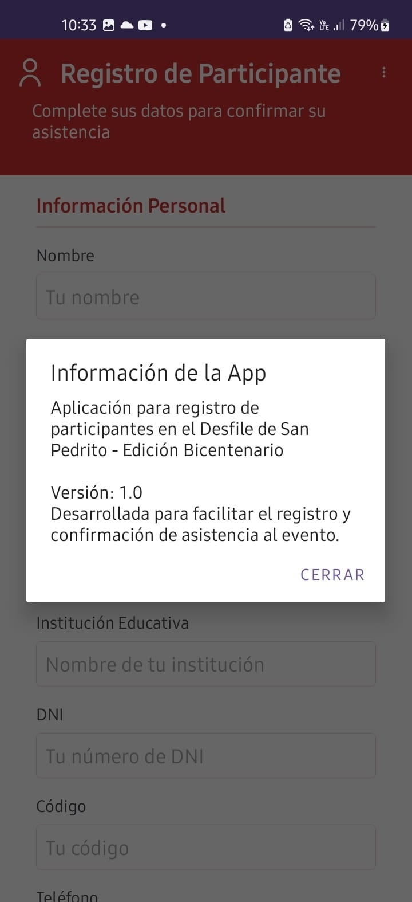 

3. COMPLETANDO INFORMACIÓN

    Procedemos a llenar la información y en el tipo de participante tenemos un dropdown con: Estudiante, Docente y Personal Administrativo

    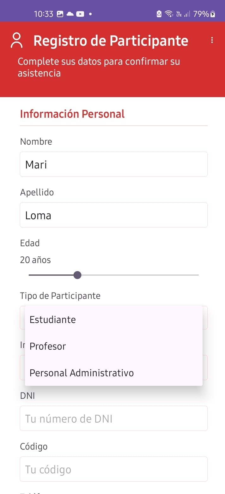

    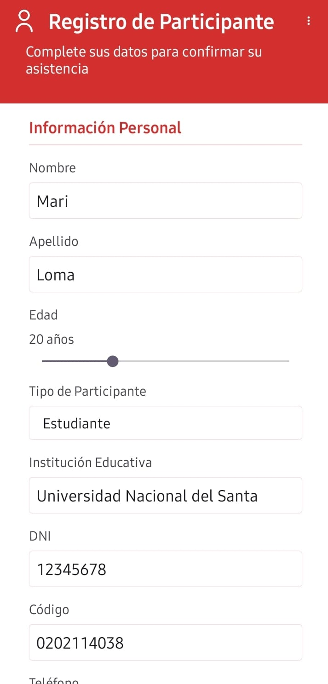

    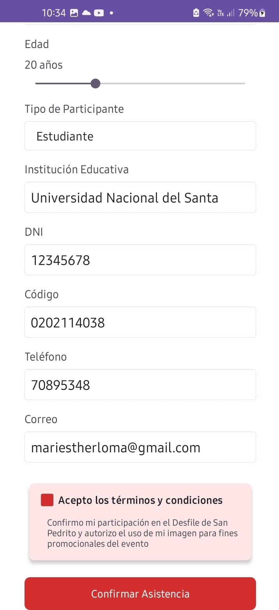

    En la última imagen se ve que cuando el checkbox esté activo el botón para Confirmar Asistencia se habilitará, mientras no se active el checkbox el botón estará inhabilitado.

4. CONFIRMACIÓN DE REGISTRO

    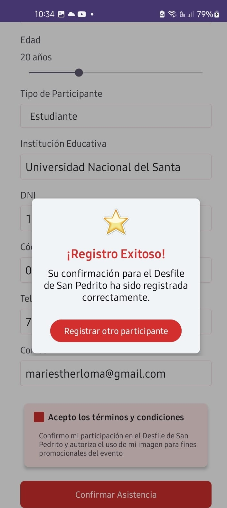

    Una vez se presione el botón de Registrar otro participante, el formulario se limpiará.
    
    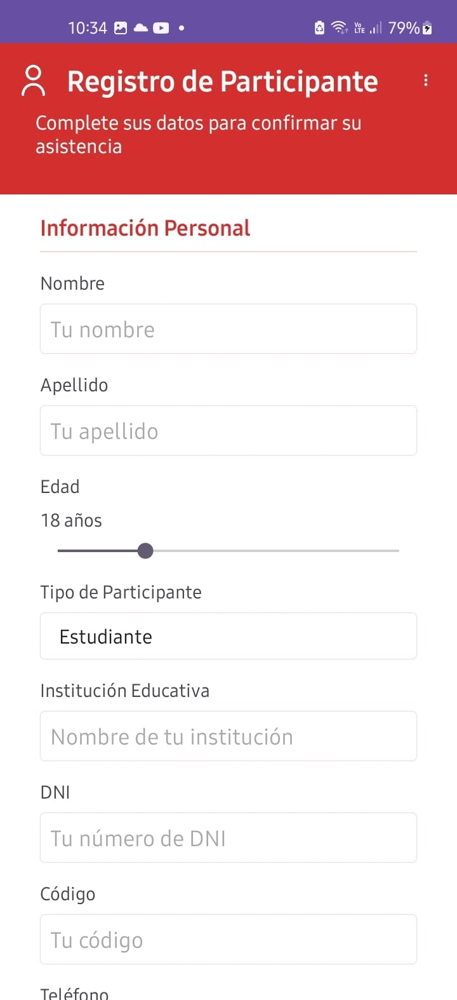

